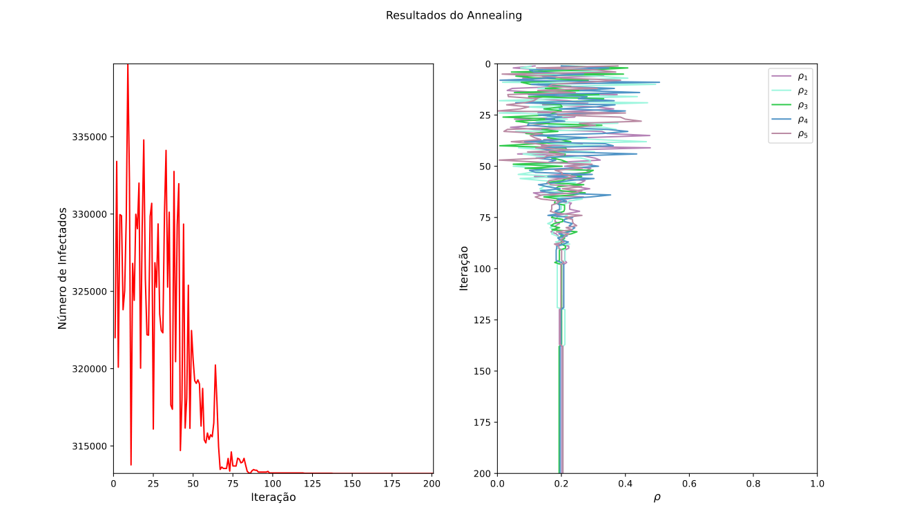
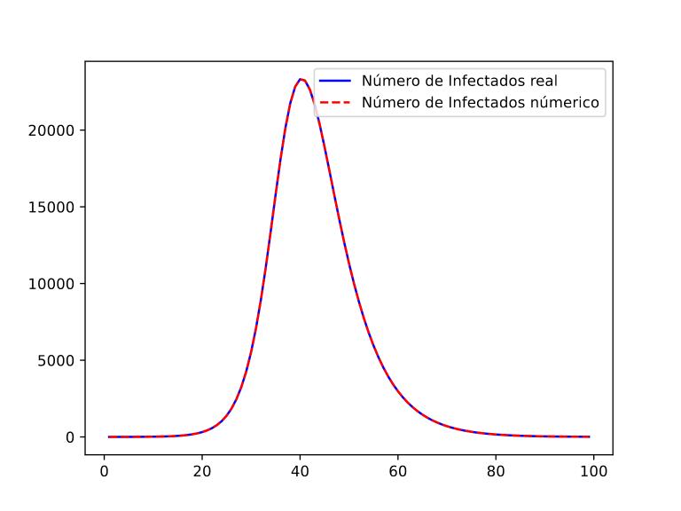

# Optimizing Vaccine Distribution and Epidemic Parameter Estimationg

This scientific initiation project, conducted at IFSP - Sertãozinho, focused on two key objectives: first, to determine the optimal distribution of vaccines across multiple populations; and second, to estimate the parameters of an epidemic model based on time series data of infected individuals.

## Previous works
This project is a continuation of previous projects done by the same advisor. You can read them at:
- [Modified SIR Compartmental Epidemic Model with Social Distancing and Hospital Saturation Applied to the COVID-19 Pandemic](http://nd.ics.org.ru/nd210303/)
- [Modelo epidêmico SIR com vacinação para duas populações: estudo numérico](https://ocs.ifsp.edu.br/conict/xiiiconict/paper/viewPaper/8489)
- [Distribuição igualitária de vacinas entre populações como melhor estratégia para combater uma pandemia: simulações computacionais a partir do modelo susceptível-infecioso-recuperado](https://ocs.ifsp.edu.br/conict/xivconict/paper/view/9877)

## Articles
This project is yet to bu published...

## Mathematical Background

###  Basic Epidemic Model
The epidemic model used was the classic SIR model where population is divided in three compartments, susceptible (S), infectious (I) and removed/recovered (R). The model assumes the population is closed, with the total population given by $S + I + R = N$

The model is governed by the following differential equation system:

$$
\frac{dS}{dt} = \alpha -\beta SI - \mu 
$$

$$
\frac{dI}{dt} = \beta SI  - \gamma I - \mu 
$$

$$
\frac{dR}{dt} = \gamma I - \mu
$$

### Vaccine Distribution
To determine the optimal vaccine distribution, additional factors were considered, including inter-population transitions, vaccination rates, and mortality rates. In this enhanced model, the rate at which individuals in population $i$ contract the disease after contact with an infected person from population $j$ is described by the following equation:

$$
S_i\left(\sum_{j=1}^m\beta_{ij}I_j\right)/N_i,
$$

With those changes we rewrite our model as:

$$
\frac{dS}{dt} = \mu_{i} N_{i} -\dfrac{S_i\left(\sum_{j=1}^n\beta_{ij}I_j\right)}{N_i} - \rho_iS_i - \mu_i S_i
$$

$$
\frac{dI}{dt} = \dfrac{S_i\left(\sum_{j=1}^n\beta_{ij}I_j\right)}{N_i}  - \gamma_i I_i - \mu_i I_i
$$

$$
\frac{dR}{dt} = \gamma_i I_i + \rho_i S_i - \mu_i R_i
$$

The relation $N_i = S_i + I_i + R_i$  still holds for each population $i$. In this updated model, $\gamma_i$ represents the recovery rate,  $\rho_i$ denotes the fraction of vaccines allocated to population $i$, and $\mu_i$ is the natural mortality rate in population $i$.

To find the optimal vaccine distribution across populations, we applied the stochastic optimization method: Simulated Annealing. This method iteratively generates new arrays, where each element represents the fraction of vaccines allocated to a specific population and has lenght equal to the amount of populations beeing considered. The goal is to minimize the "energy" of the system, which, in this case, corresponds to the total number of infected individuals.
 
### Parameter Estimation
To estimate the parameters for a given population, we solve an inverse problem. Typically, the model is provided with known parameters to generate time series for each compartment. However, in this case, we aim to determine the parameters based on an observed time series, specifically the infected population.

We consider ${\bf I_{\text{real}}} = \left[I_{\text{real}}^{(1)}, I_{\text{real}}^{(2)}, \dots, I_{\text{real}}^{(n)}\right]$, where $I_{\text{real}}^{(i)}$ is our infected number in day $i$, and we suppose a vector ${\bf x} = \left(x_1, x_2, \dots, x_m\right)$ composed of our parameters, that we feed into the classic SIR model, getting as result ${\bf I_{\text{num}}} = \left[I_{\text{num}}^{(1)}, I_{\text{num}}^{(2)}, \dots, I_{\text{real}}^{(n)}\right]$, that represents the numeric number of infecteds.

We once again use the Simulated Annealing method for optimization, but in this case, the goal is to minimize the difference between the observed infected population $I_{\text{real}}$ and the numerically simulated infected population $I_{\text{num}}$. Thus, our objective function is formulated as:

$$
f({\bf x}) = \dfrac{1}{n}\sum_{i=1}^{n}\left[I_{\text{real}}^{(i)} - I_{\text{num}}^{(i)}\right]^2
$$

## Results

### Vaccine Distribution
We successfully determined the optimal vaccine distribution for five populations. While we also tested with more than ten populations, the resulting plot became cluttered with information. For the test, we assumed all populations had identical parameters, which clearly showed that the optimal strategy was to distribute vaccines equally across populations, as expected given their homogeneity.

### Parameter Estimation
Estimating all parameters simultaneously is extremely challenging, if not impossible. Therefore, we focused on finding only the transmission rate $\beta$. First, we generated the observed infected data $I_{real}$​ by running the model with $\beta = 0.5$, and then used our code to estimate the parameter. As shown in the image below, the model successfully identified the value of $\beta$ that accurately describes the population.

## Future Goals
- Organize the project folders'
- Turn the Simulated Annealing method coded into a library
- Create a better way to declare populations in the vaccines optimization solution

## Authors

- Guilherme Santos da Silveira -  [@guilhermecom2s](https://github.com/guilhermecom2s)
- Victoria de Oliveira Spagiari - [@VictoriaSpagiari](https://github.com/VictoriaSpagiari)
- Olavo Henrique Menin (Advisor)

